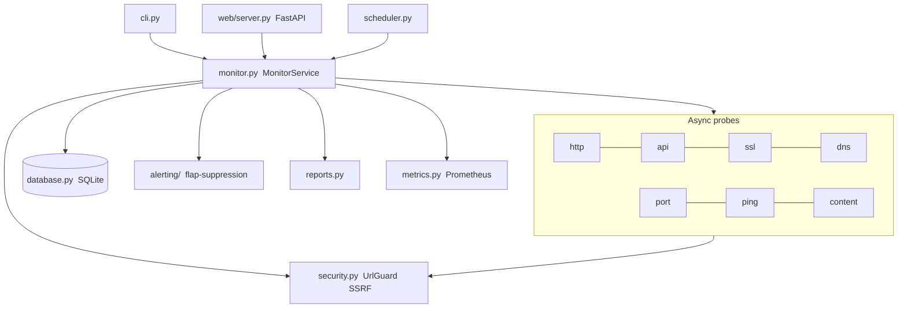

# Website Monitoring Automation

An **asynchronous**, production-grade monitoring platform that continuously
watches websites, APIs, SSL certificates, DNS records, TCP ports and network
reachability — then records history, raises de-duplicated alerts, and serves a
live dashboard, REST API and Prometheus metrics.

Built for **Windows, Linux and macOS** with security first: every outbound
request passes an **SSRF guard** (scheme allow-list, private-IP blocking,
per-hop redirect validation), and secrets never touch the logs.

[](https://github.com/mojtaba-py-code/website-monitoring-automation/actions/workflows/ci.yml)
[](https://github.com/mojtaba-py-code/website-monitoring-automation/actions/workflows/security.yml)
[](https://pypi.org/project/website-monitoring-automation/)
[](https://pypi.org/project/website-monitoring-automation/)


[](https://mypy-lang.org/)
[](https://docs.astral.sh/ruff/)

---

## Features

| Area | What it does |
|------|--------------|
| 🌐 **Availability** | HTTP status, response time, expected/forbidden keywords, redirect tracking, security-header hygiene |
| 🔐 **TLS/SSL** | Certificate issuer, validity window, expiry countdown with early warning |
| 🧭 **DNS** | Resolves A/AAAA/MX/TXT/NS (custom resolvers) and detects record changes |
| 🔌 **Ports** | Concurrent TCP reachability with per-port latency |
| 📡 **Network** | ICMP ping (packet loss / latency) |
| 🧩 **API** | JSON validation via dotted `json_path` checks |
| 🕵️ **Content** | SHA-256 checksum + change detection |
| 🚨 **Alerting** | Telegram / Slack / Discord / e-mail / signed webhook — with **flap-suppression** and recovery notices |
| 🗃 **History** | SQLite store of checks, results, events, alerts + availability analytics |
| 📊 **Reports** | HTML, JSON, CSV, Markdown, PDF |
| 📈 **Dashboard** | FastAPI live dashboard, read-only REST API, Prometheus `/metrics` |
| 🔒 **Security** | SSRF guard, redirect re-validation, response-size caps, secret redaction |

---

## Installation

Requires **Python 3.10+**.

```bash
pip install website-monitoring-automation
```

That installs the `webmon` command (and `python -m webmon`). Optional extras:

```bash
pip install "website-monitoring-automation[web]"   # live dashboard + REST API
pip install "website-monitoring-automation[pdf]"   # PDF reports
```

<details>
<summary>From source (for development)</summary>

```bash
git clone https://github.com/mojtaba-py-code/website-monitoring-automation.git
cd website-monitoring-automation

python -m venv .venv
# Windows:  .venv\Scripts\activate
# Linux/mac: source .venv/bin/activate

pip install -e ".[web,pdf,dev]"
```

</details>

---

## Quick start

```bash
# Ad-hoc checks — no config needed
webmon website example.com          # HTTP + SSL
webmon ssl example.com              # certificate expiry
webmon dns example.com              # DNS records
webmon ports example.com 443 80     # TCP ports
webmon ping example.com             # packet loss / latency

# Configured monitoring
cp config/config.example.yaml config/config.yaml   # then edit your targets
webmon list                         # show configured targets
webmon check                        # run one cycle over all targets
webmon --json --html report         # cycle + write reports
webmon run                          # continuous scheduled monitoring
webmon dashboard                    # live dashboard at http://127.0.0.1:8899
```

---

## Command overview

```
webmon <command> [options]

  check       Run one monitoring cycle over configured targets
  run         Continuous scheduled monitoring (per-target intervals)
  website     Ad-hoc HTTP + SSL check of a URL/host
  api         Ad-hoc JSON API check
  ssl         Ad-hoc certificate check
  dns         Ad-hoc DNS resolution
  ping        Ad-hoc ICMP ping
  ports       Ad-hoc TCP port check
  report      Run a cycle and write reports
  export      Export monitoring history (json/csv)
  list        List configured targets
  dashboard   Launch the web dashboard + REST API + metrics
  schedule    Print cron / Task Scheduler equivalents

Global: --config --data-dir --timeout --interval --threads
        --verbose --silent --json --csv --html
```

Full reference: [docs/CLI.md](docs/CLI.md).

---

## Architecture



A thin CLI / web / scheduler layer drives a single async **MonitorService**,
which runs independent probes concurrently (bounded by a semaphore), persists
results, detects state/content/DNS changes, and dispatches alerts. Everything is
injected (config + guard), so each probe is unit-testable in isolation. See
[docs/ARCHITECTURE.md](docs/ARCHITECTURE.md).

---

## Security model

* **SSRF guard** — outbound requests are validated before connecting: scheme
  allow-list, host block/allow-lists, and rejection of private / loopback /
  link-local / reserved IPs (configurable). The cloud-metadata endpoint
  `169.254.169.254` is block-listed by default, and the block-list is enforced
  against the *resolved* addresses too, so a hostname pointing at a blocked IP
  cannot slip through.
* **Redirect re-validation** — redirects are followed manually and every hop is
  re-checked, so an open redirect cannot bounce a probe onto an internal host.
  `Authorization`/`Cookie` headers are dropped on cross-host hops.
* **Response caps** — bodies are read with a hard size limit to bound memory.
* **Secret hygiene** — tokens/passwords are referenced via `${ENV:VAR}` and
  redacted from any log line; failed alert deliveries log only a status code /
  error type, never the URL or token.
* **Verified SMTP TLS** — the e-mail channel passes its own SSL context, so the
  certificate chain *and* hostname are checked (`smtplib`'s default STARTTLS
  context verifies neither), and credentials are never sent over cleartext.
  Written up in detail, with a runnable proof:
  [Python's smtplib doesn't verify TLS certificates by default](https://dev.to/mojtaba_pycode/pythons-smtplib-doesnt-verify-tls-certificates-by-default-1bla).
* **Read-only web API** — the dashboard never mutates state. When
  `web.api_token` is set it gates every data route — `/api/*`, `/metrics` and
  the dashboard — compared in constant time; browsers exchange the token at
  `/login` for an HttpOnly, SameSite=Strict cookie holding an HMAC *derived*
  from it, so a stolen cookie cannot be replayed as an API credential. The server refuses to
  bind to a non-localhost interface unless a token is set.

---

## Configuration (excerpt)

```yaml
security:
  block_private_networks: true          # keep true for internet monitoring
  blocklist_hosts: ["169.254.169.254"]   # matched on the host AND its resolved IPs
targets:
  - name: "Example Website"
    url: "https://example.com"
    checks: ["http", "ssl", "dns", "content"]
    expected_status: [200]
    expected_keywords: ["Example Domain"]
alerting:
  enabled: true
  failure_threshold: 2                   # alert after N consecutive failures
  channels:
    telegram: { enabled: true, bot_token: "${ENV:TELEGRAM_BOT_TOKEN}", chat_id: "${ENV:TELEGRAM_CHAT_ID}" }
```

Full reference: [docs/CONFIGURATION.md](docs/CONFIGURATION.md).

---

## Dashboard, API & metrics

```bash
pip install -e ".[web]"
webmon dashboard --host 127.0.0.1 --port 8899
```

* Dashboard: `http://127.0.0.1:8899`
* REST API: `/api/status`, `/api/target/{name}`, `/api/events`, `/api/alerts`
* Prometheus: `/metrics` (scrape into Grafana)

See [docs/API.md](docs/API.md) and [docs/DASHBOARD.md](docs/DASHBOARD.md).

---

## Docker

```bash
docker compose -f deploy/docker-compose.yml up --build
```

See [docs/DEPLOYMENT.md](docs/DEPLOYMENT.md).

---

## Development

```bash
pip install -e ".[dev,web,pdf]"
ruff check src tests      # lint + flake8-bandit security rules
mypy                      # strict type-check
pytest --cov              # tests + coverage
```

Quality gates on every change: **ruff** clean (security rules included), **mypy**
strict clean, **pytest** green (126 tests, ~84% coverage), and no real network in
tests — HTTP is mocked with `respx`, and DNS/ICMP/TLS are monkeypatched. CI runs
all three on Linux, Windows and macOS across Python 3.10–3.12, plus a package
build, a Docker build, a `pip-audit` dependency scan and CodeQL analysis.

Use a virtual environment: running `mypy` against a global site-packages
directory can surface errors from unrelated third-party stubs.

See [docs/DEVELOPER.md](docs/DEVELOPER.md), [CONTRIBUTING.md](CONTRIBUTING.md)
and, for common issues, [docs/TROUBLESHOOTING.md](docs/TROUBLESHOOTING.md).

---

## Project

| | |
|---|---|
| Changelog | [CHANGELOG.md](CHANGELOG.md) |
| Contributing | [CONTRIBUTING.md](CONTRIBUTING.md) |
| Security policy & threat model | [SECURITY.md](SECURITY.md) |
| Code of conduct | [CODE_OF_CONDUCT.md](CODE_OF_CONDUCT.md) |

Found a security issue? Please report it privately — see
[SECURITY.md](SECURITY.md), not the public issue tracker.

## License

MIT — see [LICENSE](LICENSE).
